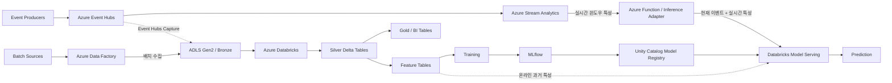

# Azure Real-Time ML Platform

[English](README.md) | [한국어](README.ko.md)

> **기준 문서:** 영어. 영어 문서와 한국어 번역본의 내용이 다를 경우 영어 문서를 우선합니다.

Event Hubs, Stream Analytics, ADLS Gen2, Data Factory, Azure Databricks 및 Databricks 기반 MLOps를 사용하는 실시간 Azure 데이터/머신러닝 플랫폼 팀 프로젝트입니다.

## 아키텍처 한눈에 보기

설계는 세 가지 관심사를 의도적으로 분리합니다.

- **실시간 추론:** Event Hubs → Stream Analytics → inference adapter → Databricks Model Serving
- **과거 데이터 + 학습:** Event Hubs Capture → ADLS → Databricks → Feature Table → MLflow / Unity Catalog
- **배치 수집 + 오케스트레이션:** 외부 배치 소스 → Data Factory → ADLS / Databricks Jobs

핵심 원칙은 운영 환경에서는 Stream Analytics가 단기 event-time 특성을 계산하고, 학습 데이터셋을 만들 때는 Databricks가 과거 이벤트에서 동일한 특성 의미를 재구성하는 것입니다. 이를 통해 학습 파이프라인이 Stream Analytics 출력 저장 여부에 종속되지 않습니다.

## 문서

- [시스템 아키텍처](docs/ko/architecture.md)
- [컴포넌트 계약](docs/ko/component-contracts.md)
- [온라인 추론 파이프라인](docs/ko/online-inference.md)
- [오프라인 학습 및 MLOps](docs/ko/offline-training.md)
- [Feature Contract](docs/ko/feature-contracts.md)
- [원자적 작업 분해](docs/ko/development/task-decomposition.md)
- [ADR-001: Stream Analytics와 Databricks](docs/ko/decisions/ADR-001-stream-analytics-and-databricks.md)
- [ADR-002: Databricks 단독 MLOps](docs/ko/decisions/ADR-002-databricks-only-mlops.md)
- [ADR-003: 스트리밍 특성 오프라인 재구성](docs/ko/decisions/ADR-003-feature-reconstruction.md)

## 기본 원칙

각 서비스는 서로 구분되는 운영 책임을 가져야 합니다. 단순히 특정 Azure 리소스를 사용해 보기 위한 목적으로 아키텍처에 포함하지 않습니다.
