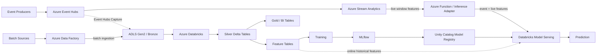

# Azure Real-Time ML Platform

Architecture-first team project for a real-time Azure data and machine-learning platform using Event Hubs, Stream Analytics, ADLS Gen2, Data Factory, and Azure Databricks with Databricks-native MLOps.

## Architecture at a glance

The design deliberately separates three concerns:

- **Real-time inference:** Event Hubs → Stream Analytics → inference adapter → Databricks Model Serving.
- **Historical data + training:** Event Hubs Capture → ADLS → Databricks → feature tables → MLflow / Unity Catalog.
- **Batch ingestion + orchestration:** external batch sources → Data Factory → ADLS / Databricks jobs.

A key design rule is that Stream Analytics computes short-lived event-time features in production, while Databricks reconstructs the same feature semantics from historical events when building training datasets. This avoids making the training pipeline depend on persisted Stream Analytics outputs.

## Documentation

- [System architecture](docs/architecture.md)
- [Online inference pipeline](docs/online-inference.md)
- [Offline training and MLOps](docs/offline-training.md)
- [Feature contracts](docs/feature-contracts.md)
- [ADR-001: Stream Analytics and Databricks](docs/decisions/ADR-001-stream-analytics-and-databricks.md)
- [ADR-002: Databricks-only MLOps](docs/decisions/ADR-002-databricks-only-mlops.md)
- [ADR-003: Reconstruct streaming features offline](docs/decisions/ADR-003-feature-reconstruction.md)

## Guiding principle

Every service must have a distinct operational responsibility. A resource should not be included merely to demonstrate familiarity with it.
