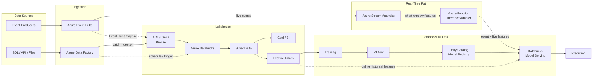
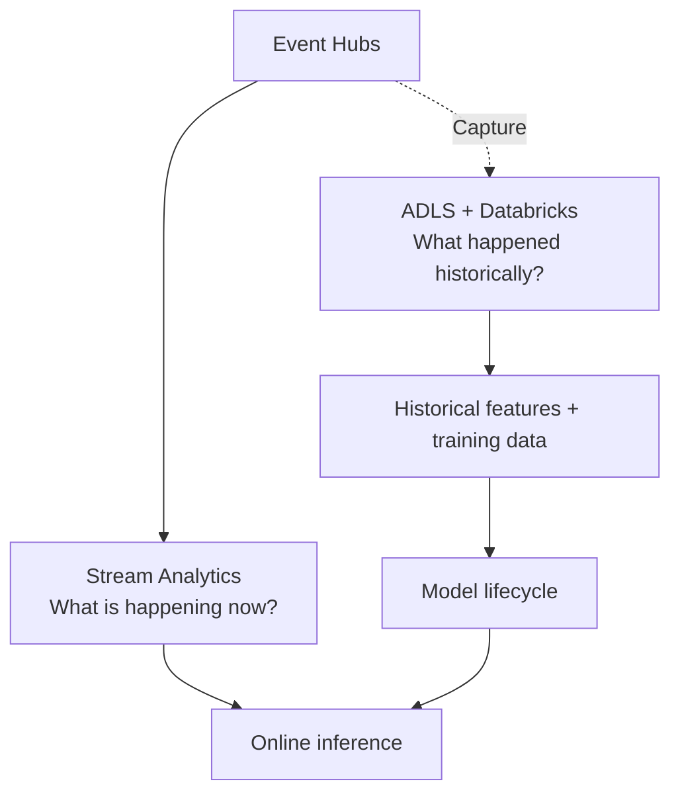
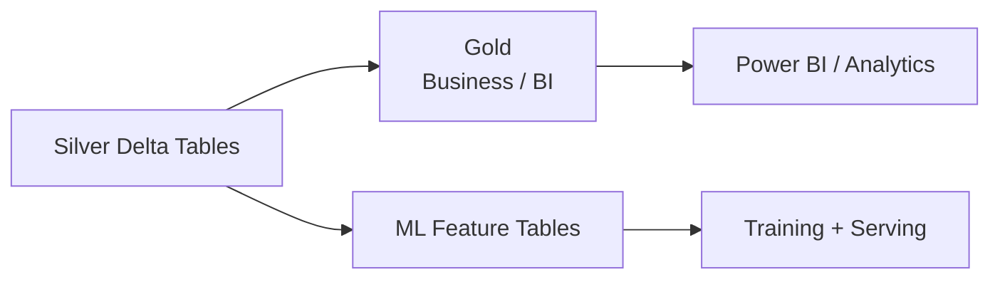

# System Architecture

[English](../en/architecture.md) | [한국어](../ko/architecture.md)

> English is the canonical documentation. If translations diverge, the English version is authoritative.

## Service boundaries

| Component | Primary responsibility |
|---|---|
| Azure Event Hubs | Real-time event ingestion and buffering |
| Event Hubs Capture | Persist raw event history to ADLS |
| Azure Stream Analytics | Low-latency event-time filtering and window features |
| ADLS Gen2 | Durable lake storage / source of truth |
| Azure Databricks | Heavy transformation, historical feature engineering, training and MLOps |
| Azure Data Factory | Batch ingestion and high-level orchestration |
| Azure Function | Lightweight inference integration and schema validation |
| Databricks Model Serving | Production model inference |
| MLflow + Unity Catalog | Experiment tracking, model registry and governance |

## End-to-end view

## Why the architecture forks after Event Hubs

The live and historical paths have different goals:

Stream Analytics is therefore not the permanent source of ML training features. Raw events are retained independently so historical features can be reconstructed, backfilled and redefined later.

## Data-layer rule

Gold tables and ML feature tables are separate concepts:

This prevents business-facing aggregates from becoming an accidental ML contract.
