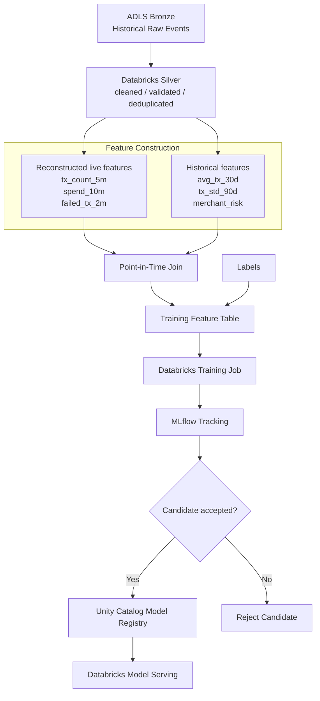
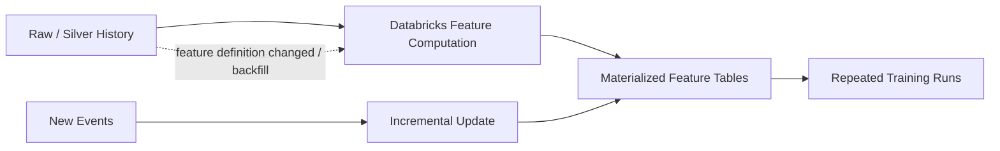

# Offline Training and Databricks MLOps

[English](../en/offline-training.md) | [한국어](../ko/offline-training.md)

> English is the canonical documentation. If translations diverge, the English version is authoritative.

Training uses historical raw events retained through Event Hubs Capture. Databricks reconstructs the same short-window feature semantics used by Stream Analytics in production, then joins them with long-term historical features and labels using point-in-time correctness.

## Example training row

| event_time | amount | tx_count_5m | spend_10m | avg_tx_30d | tx_std_90d | merchant_risk | label |
|---|---:|---:|---:|---:|---:|---:|---:|
| 14:03:10 | 900 | 7 | 3200 | 72.4 | 48.1 | 0.14 | 1 |

For this row, Databricks calculates every feature using only data that would have been available at the prediction timestamp. Future data must never leak into historical training features.

## Reconstruction does not mean full recomputation every run

Stable, expensive features should be materialized and updated incrementally. Raw history remains available for backfills or new feature definitions.
