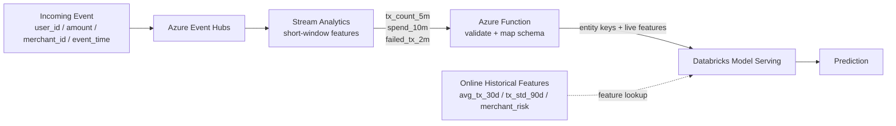

# Online Inference Pipeline

[English](../en/online-inference.md) | [한국어](../ko/online-inference.md)

> English is the canonical documentation. If translations diverge, the English version is authoritative.

The online path is optimized for low latency. Stream Analytics computes only short-lived event-time features; historical features are served from Databricks-managed feature tables.

## Example model input

| Feature | Source at inference time |
|---|---|
| `amount` | Current event |
| `tx_count_5m` | Stream Analytics |
| `spend_10m` | Stream Analytics |
| `failed_tx_2m` | Stream Analytics |
| `avg_tx_30d` | Databricks feature table |
| `tx_std_90d` | Databricks feature table |
| `merchant_risk` | Databricks feature table |

## Boundary rules

- Stream Analytics does not perform long historical joins or heavy data cleansing.
- Azure Function does not calculate large-scale features; it handles lightweight integration concerns.
- Databricks Model Serving receives the complete serving context and performs inference.
- ADLS is not queried synchronously on the inference path.
