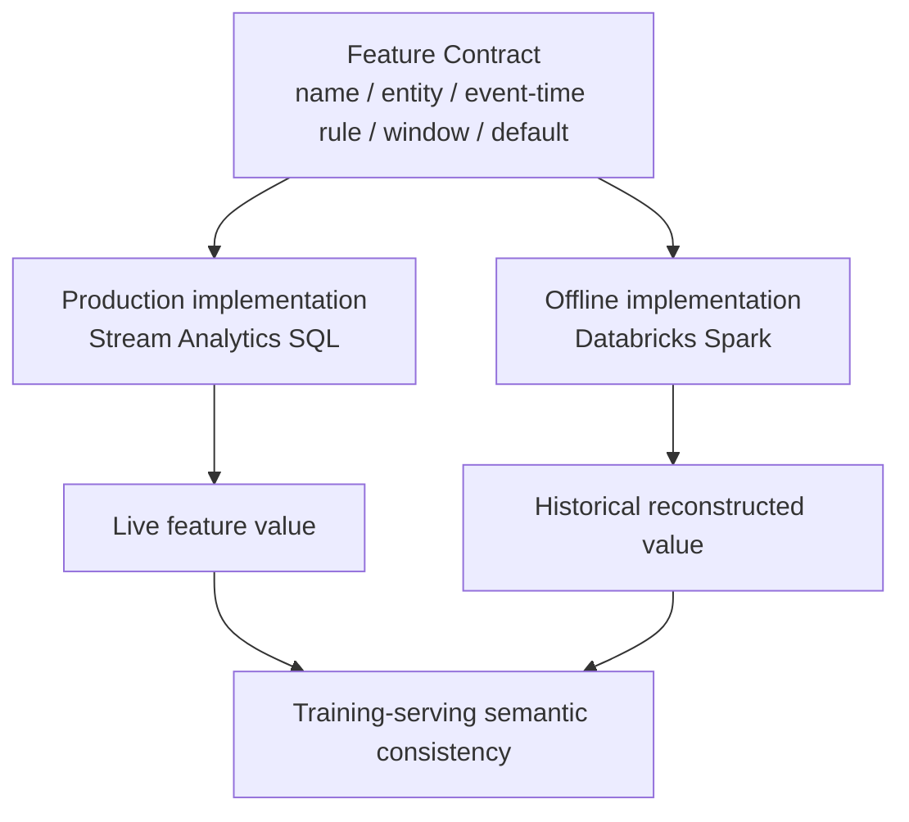

# Feature Contracts

Features that exist in both the real-time and offline paths must share one semantic contract even though they are implemented in different engines.



## Example contract

```yaml
name: transaction_count_5m
version: 1
entity_keys:
  - user_id
time_column: event_time
window:
  type: sliding
  duration: 5m
  interval: "[T-5m, T)"
aggregation:
  operation: count
default: 0
data_type: long
implementations:
  realtime: stream-analytics
  offline: databricks
```

## Contract rules

1. The same event-time semantics must be used by both implementations.
2. Window boundaries must be explicit.
3. Null/default behavior must be identical.
4. Type conversions must be deterministic.
5. Feature definition changes require a version change.
6. Historical training reconstruction must be testable against known Stream Analytics examples.

The contract is the source of truth; neither the Stream Analytics query nor the Databricks implementation alone defines the feature.
