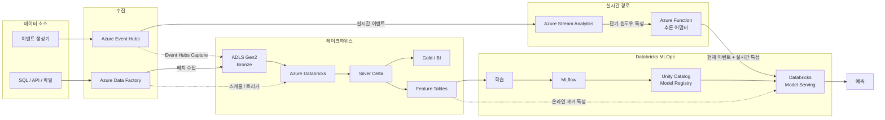
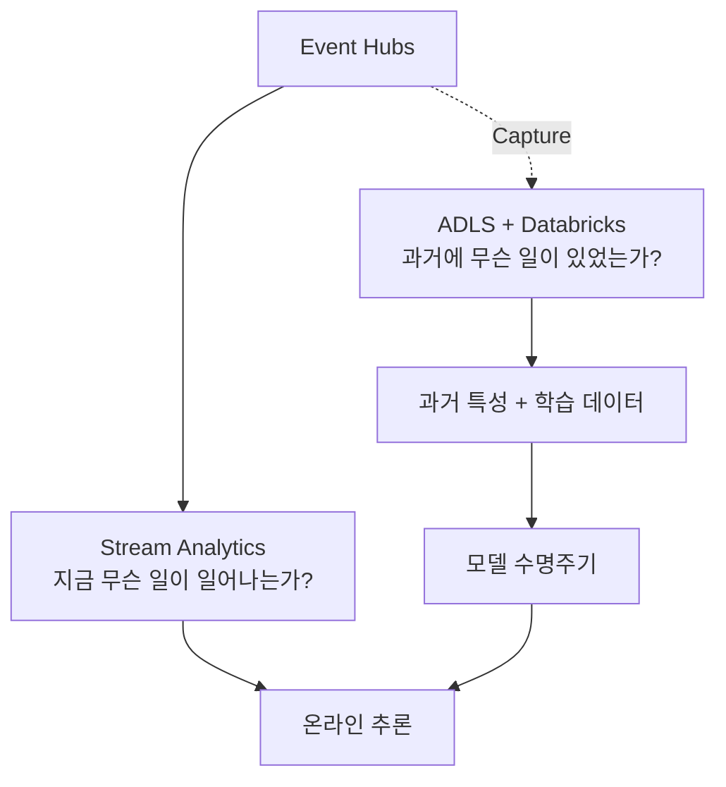
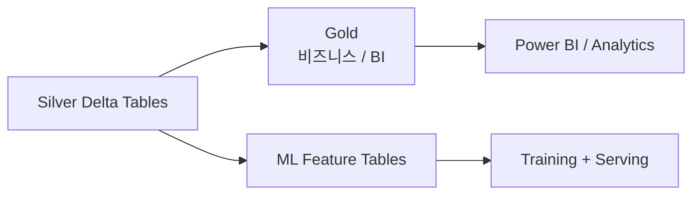

# 시스템 아키텍처

[English](../en/architecture.md) | [한국어](../ko/architecture.md)

> 영어 문서가 기준 문서(canonical documentation)입니다. 번역본과 내용이 다를 경우 영어 문서를 우선합니다.

## 서비스 경계

| 컴포넌트 | 주요 책임 |
|---|---|
| Azure Event Hubs | 실시간 이벤트 수집 및 버퍼링 |
| Event Hubs Capture | 원시 이벤트 이력을 ADLS에 영구 저장 |
| Azure Stream Analytics | 저지연 이벤트 시간 기반 필터링 및 윈도우 특성 계산 |
| ADLS Gen2 | 내구성 있는 데이터 레이크 / 원본 기준 저장소 |
| Azure Databricks | 대규모 변환, 과거 특성 엔지니어링, 학습 및 MLOps |
| Azure Data Factory | 배치 수집 및 상위 수준 오케스트레이션 |
| Azure Function | 경량 추론 연동 및 스키마 검증 |
| Databricks Model Serving | 운영 모델 추론 |
| MLflow + Unity Catalog | 실험 추적, 모델 레지스트리 및 거버넌스 |

## 전체 흐름

## Event Hubs 이후 경로를 분리하는 이유

실시간 경로와 과거 데이터 경로는 목적이 다릅니다.

따라서 Stream Analytics 출력은 ML 학습 데이터의 영구 기준 소스가 아닙니다. 원시 이벤트를 별도로 보존함으로써 Databricks에서 과거 특성을 재구성하고, 백필하며, 정의를 변경할 수 있습니다.

## 데이터 계층 원칙

Gold 테이블과 ML Feature Table은 별개의 개념입니다.

이를 통해 비즈니스용 집계 테이블이 의도치 않게 ML 계약으로 굳어지는 것을 방지합니다.
