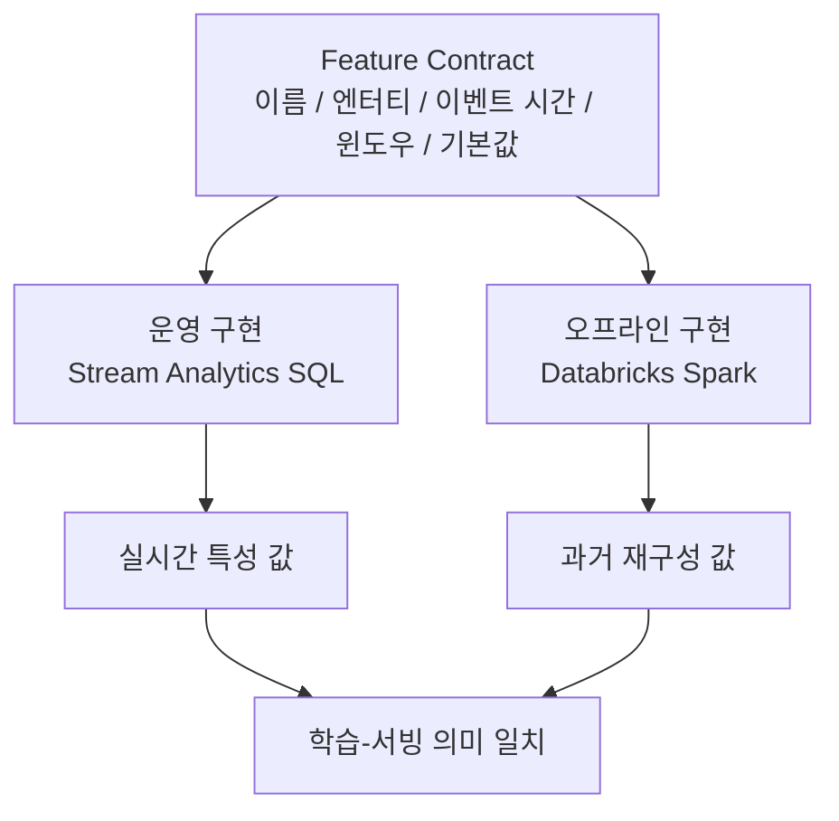

# Feature Contract

[English](../en/feature-contracts.md) | [한국어](../ko/feature-contracts.md)

> 영어 문서가 기준 문서입니다. 번역본과 내용이 다를 경우 영어 문서를 우선합니다.

실시간 경로와 오프라인 경로에 모두 존재하는 특성은 서로 다른 엔진에서 구현되더라도 하나의 의미 계약을 공유해야 합니다.



## 예시 계약

```yaml
name: transaction_count_5m
version: 1
entity_keys:
  - user_id
time_column: event_time
window:
  type: sliding
  duration: 5m
  interval: "[T-5m, T)"
aggregation:
  operation: count
default: 0
data_type: long
implementations:
  realtime: stream-analytics
  offline: databricks
```

## 계약 원칙

1. 두 구현은 동일한 event-time 의미를 사용해야 합니다.
2. 윈도우 경계를 명시해야 합니다.
3. null/default 처리 방식이 동일해야 합니다.
4. 타입 변환은 결정적이어야 합니다.
5. 특성 정의가 변경되면 버전을 변경해야 합니다.
6. Databricks의 과거 재구성 결과는 알려진 Stream Analytics 결과와 비교 테스트할 수 있어야 합니다.

Feature Contract가 기준이며, Stream Analytics 쿼리나 Databricks 구현 어느 한쪽만으로 특성의 의미가 결정되지 않습니다.
