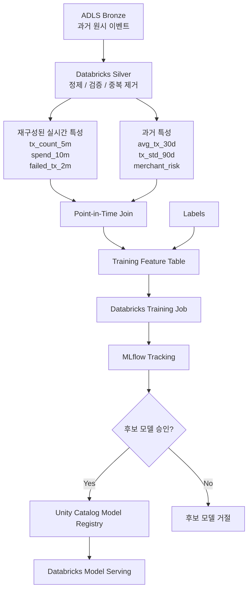

# 오프라인 학습 및 Databricks MLOps

[English](../en/offline-training.md) | [한국어](../ko/offline-training.md)

> 영어 문서가 기준 문서입니다. 번역본과 내용이 다를 경우 영어 문서를 우선합니다.

학습에는 Event Hubs Capture를 통해 보존한 과거 원시 이벤트를 사용합니다. Databricks는 운영 환경에서 Stream Analytics가 생성하는 단기 윈도우 특성과 동일한 의미를 과거 데이터에서 재구성한 뒤, 장기 과거 특성 및 라벨과 point-in-time 방식으로 결합합니다.

## 학습 행 예시

| event_time | amount | tx_count_5m | spend_10m | avg_tx_30d | tx_std_90d | merchant_risk | label |
|---|---:|---:|---:|---:|---:|---:|---:|
| 14:03:10 | 900 | 7 | 3200 | 72.4 | 48.1 | 0.14 | 1 |

각 특성은 해당 과거 예측 시점에 실제로 사용 가능했던 데이터만 사용해야 합니다. 미래 데이터가 과거 학습 특성에 포함되면 안 됩니다.

## 재구성은 매 학습마다 전체 재계산을 의미하지 않음

안정적이고 계산 비용이 큰 특성은 materialize하고 증분 갱신합니다. 원시 이력은 특성 정의 변경이나 백필이 필요할 때 다시 계산할 수 있도록 보존합니다.
