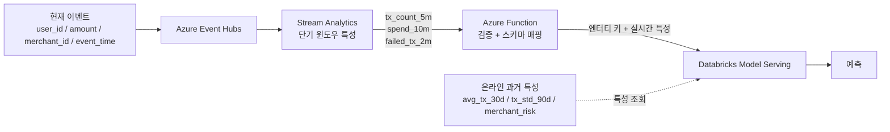

# 온라인 추론 파이프라인

[English](../en/online-inference.md) | [한국어](../ko/online-inference.md)

> 영어 문서가 기준 문서입니다. 번역본과 내용이 다를 경우 영어 문서를 우선합니다.

온라인 경로는 낮은 지연시간을 목표로 합니다. Stream Analytics는 짧은 시간 범위의 이벤트 기반 특성만 계산하고, 장기 과거 특성은 Databricks가 관리하는 Feature Table에서 제공합니다.

## 모델 입력 예시

| 특성 | 추론 시점 소스 |
|---|---|
| `amount` | 현재 이벤트 |
| `tx_count_5m` | Stream Analytics |
| `spend_10m` | Stream Analytics |
| `failed_tx_2m` | Stream Analytics |
| `avg_tx_30d` | Databricks Feature Table |
| `tx_std_90d` | Databricks Feature Table |
| `merchant_risk` | Databricks Feature Table |

## 경계 원칙

- Stream Analytics는 장기간 과거 조인이나 대규모 데이터 정제를 수행하지 않습니다.
- Azure Function은 대규모 특성 계산을 하지 않고 경량 연동만 담당합니다.
- Databricks Model Serving은 완성된 서빙 컨텍스트를 받아 모델 추론을 수행합니다.
- 온라인 추론 경로에서는 ADLS를 동기적으로 조회하지 않습니다.
